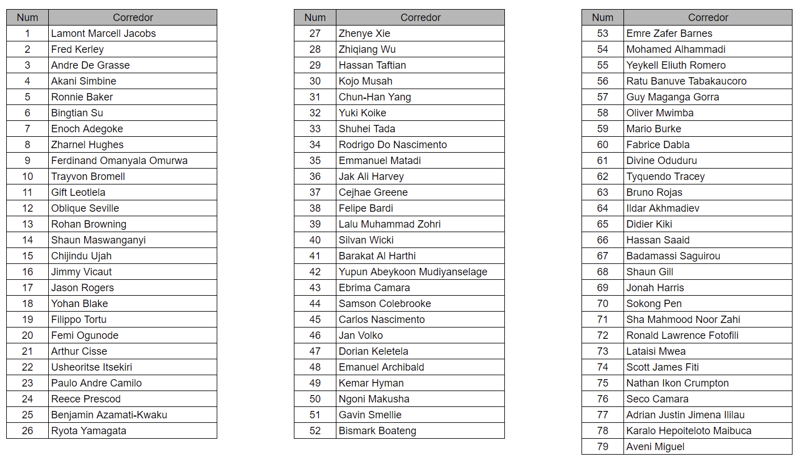

# Ejemplo de la clasificación

1. Imaginemos que tenemos la siguiente lista de corredores inscriptos para competir en estos JJOO (un total de 79 corredores):

  

2. Ahora ubicamos a los corredores de manera aleatoria en los heats según se pidió en el enunciado
   (7 heats de 9 corredores y 2 heat de 8 corredores):

  

3. Ahora supongamos que recibimos los siguientes resultados de los heats:

> En verde vemos marcados a los 2 corredores que ganaron su carrera y pasaron a la semifinal directamente.

  

4. Ahora, con los resultados de los heats, debemos quitar a los clasificados directamente y ordenar a los corredores 
   que no ganaron su heat en base a su tiempo para determinar **los 6 corredores que pasan a la semifinal**.

> En verde vemos marcados a los 6 corredores que clasificaron a la semifinal por mejor tiempo.

  

5. Finalmente con los 18 corredores que clasificaron directamente y los 6 corredores que clasificaron por tiempo, 
   armamos las 3 semifinales de 8 corredores cada una.

> Otra vez armamos las carreras en el orden que quedo la lista, sin mayor logica que dividiendo la lista de 24 
> corredores en 3 semifinales de 8 corredores cada una.

  

6. Ahora supongamos que recibimos los resultados de las semifinales, otra vez debemos repetir el proceso anterior
  y separar a los ganadores de las carreras (clasificados directos), de los clasificados por tiempo para armar la final.

> En verde vemos marcados a los 2 corredores que ganaron su semifinal y pasaron a la final directamente.
> En amarillo vemos marcados a los 2 corredores que clasificaron a la final por mejor tiempo.

  

7. Una vez que recibimos los tiempos de carrera de la final, ya estamos en condiciones de armar la tabla de posiciones
   final.

> Primero ubicamos a los corredores de la final, luego a los de la semifinal (sin incluir los previos) y por ultimo a 
> los que no pasaron de los heats. En todos los casos ordenados por menor tiempo.

  

