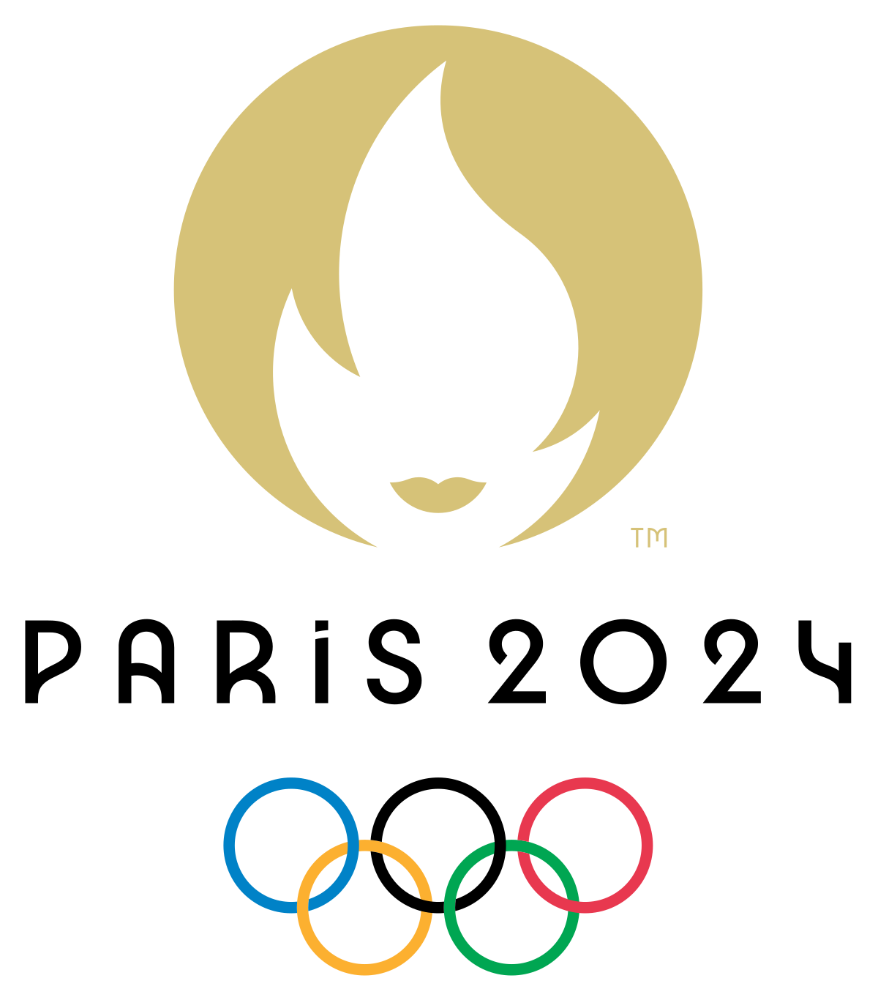

  

# JJOO Paris 2024

Los Juegos Olímpicos son la única competición verdaderamente global, multideportiva y que celebra el deporte en el mundo. 
Con más de 200 países que participan en más de 400 eventos entre los Juegos de Verano y de Invierno, los Juegos son 
donde todo el mundo acude a competir, a inspirarse y a estar juntos.

Los Juegos Olímpicos de París 2024, oficialmente conocidos como los Juegos de la XXXIII Olimpiada, se llevará a cabo 
entre el 26 de julio y el 11 de agosto de 2024 en la ciudad de París, Francia.

Esta es la lista de deportes que se llevarán a cabo en los Juegos Olímpicos de París 2024:
<table>
<tr><th>ATLETISMO</th><th>BÁDMINTON</th><th>BALONCESTO</th><th>BALONCESTO 3X3</th></tr>
<tr><th>BALONMANO</th><th>BOXEO</th><th>BREAKING</th><th>CICLISMO BMX FREESTYLE</th></tr>
<tr><th>CICLISMO BMX RACING</th><th>CICLISMO DE MONTAÑA</th><th>CICLISMO EN PISTA</th><th>CICLISMO EN RUTA</th></tr>
<tr><th>ESCALADA DEPORTIVA</th><th>ESGRIMA</th><th>FÚTBOL</th><th>GIMNASIA ARTÍSTICA</th></tr>
<tr><th>GIMNASIA EN TRAMPOLÍN</th><th>GIMNASIA RÍTMICA</th><th>GOLF</th><th>HALTEROFILIA</th></tr>
<tr><th>HÍPICA</th><th>HOCKEY SOBRE CÉSPED</th><th>JUDO</th><th>LUCHA</th></tr>
<tr><th>NATACIÓN</th><th>NATACIÓN ARTÍSTICA</th><th>NATACIÓN EN AGUAS ABIERTAS</th><th>PENTATLÓN MODERNO</th></tr>
<tr><th>PIRAGÜISMO EN ESLALON</th><th>PIRAGÜISMO EN ESPRINT</th><th>REMO</th><th>RUGBY 7</th></tr>
<tr><th>SALTOS</th><th>SKATEBOARDING</th><th>SURF</th><th>TAEKWONDO</th></tr>
<tr><th>TENIS</th><th>TENIS DE MESA</th><th>TIRO</th><th>TIRO CON ARCO</th></tr>
<tr><th>TRIATLÓN</th><th>VELA</th><th>VOLEIBOL</th><th>VOLEIBOL PLAYA</th></tr>
<tr><th>WATERPOLO</th></tr>
</table>

Al igual que en todas las ediciones, el atletismo es una de las disciplinas más importantes de los Juegos Olímpicos.

## Atletismo

Era una elección lógica incluir el atletismo en los Juegos Inaugurales de los Olímpicos modernos, celebrados en 1896 
en Atenas (Grecia). Su antigua posición en el programa olímpico hace del atletismo la joya de la corona de los Juegos 
de verano. Los eventos masculinos se han mantenido sin cambios desde los Juegos de Los Ángeles 1932, salvo la adición de 
la carrera de 20km de marcha atlética en los Juegos de Melbourne 1956. Los eventos femeninos aparecieron por primera vez 
en los Juegos Olímpicos de Ámsterdam 1928. Las mujeres sólo tenían 17 pruebas hasta 1992, pero con la incorporación de 
los 3.000m con obstáculos femeninos en 2008, las atletas femeninas compiten ahora en el mismo número de eventos que sus 
homólogos masculinos.

En la década de 1960 se produjo un auge del atletismo en los países en desarrollo, y el alcance de este deporte se 
extendió por todo el mundo. En los Juegos de Beijing 2008, atletas de 62 países compitieron en las pruebas finales.

Estos son los eventos de atletismo que se llevarán a cabo en los Juegos Olímpicos de París 2024:
<table>
<tr><th>100 m masculinos</th><th>200 m masculinos</th><th>400 m masculinos</th><th>800 m masculinos</th></tr>
<tr><th>1500 m masculinos</th><th>5000 m masculinos</th><th>10.000 m masculinos</th><th>Maratón masculino</th></tr>
<tr><th>3000 m obstáculos masculinos</th><th>110 m vallas masculinos</th><th>400 m vallas masculinos</th><th>Salto de altura masculino</th></tr>
<tr><th>Salto con pértiga masculino</th><th>Salto de longitud masculino</th><th>Triple salto masculino</th><th>Lanzamiento de peso masculino</th></tr>
<tr><th>Lanzamiento de disco masculino</th><th>Lanzamiento de martillo masculino</th><th>Lanzamiento de jabalina masculino</th><th>Decatlón masculino</th></tr>
<tr><th>20 km marcha masculinos</th><th>Relevo 4x100 m masculino</th><th>Relevo 4x400 m masculino</th><th>100 m femeninos</th></tr>
<tr><th>200 m femeninos</th><th>400 m femeninos</th><th>800 m femeninos</th><th>1500 m femeninos</th></tr>
<tr><th>5000 m femeninos</th><th>10.000 m femeninos</th><th>Maratón femenino</th><th>3000 m obstáculos femeninos</th></tr>
<tr><th>100 m vallas femeninos</th><th>400 m vallas femeninos</th><th>Salto de altura femenino</th><th>Salto con pértiga femenino</th></tr>
<tr><th>Salto de longitud femenino</th><th>Triple salto femenino</th><th>Lanzamiento de peso femenino</th><th>Lanzamiento de disco femenino</th></tr>
<tr><th>Lanzamiento de martillo femenino</th><th>Lanzamiento de jabalina femenino</th><th>Heptatlón femenino</th><th>20 km marcha femeninos</th></tr>
<tr><th>Relevo 4x100 m femenino</th><th>Relevo 4x400 m femenino</th><th>Relevo 4x400 m mixto</th><th>Maratón de marcha por relevos mixtos</th></tr>
</table>

## 100 m masculinos

La competencia de los 100 metros planos en los Juegos Olímpicos es uno de los eventos más destacados y emocionantes del 
atletismo. Aquí tienes una descripción detallada de cómo se organizan las carreras y cómo los atletas se clasifican 
para la final:

### Formato de la Competencia

1. Rondas de Clasificación (Heats)
   - Todos los atletas inscritos en la competencia participan en las rondas de clasificación. Los atletas se dividen en varias series (heats).
   - Los mejores tiempos de cada serie y algunos de los mejores tiempos entre todos los atletas que no ganaron sus series avanzan a las siguientes rondas.
   - El número exacto de series y el número de atletas que avanzan puede variar dependiendo del número total de participantes.
2. Cuartos de Final (en algunos casos)
   - Si hay un gran número de participantes, se pueden organizar cuartos de final después de las rondas de clasificación.
   - De nuevo, los mejores tiempos de cada carrera y algunos de los mejores tiempos entre todos los atletas que no ganaron sus carreras avanzan a las semifinales.
3. Semifinales
   - Los atletas que han avanzado de las rondas anteriores compiten en las semifinales.
   - Normalmente hay dos o tres semifinales. Los mejores tiempos de cada semifinal y algunos de los mejores tiempos entre todos los atletas que no ganaron sus carreras avanzan a la final.
4. Final
   - Los atletas que se clasifican de las semifinales compiten en la final.
   - La final generalmente consiste en ocho atletas.
   - El ganador de esta carrera es el que se lleva la medalla de oro, el segundo lugar recibe la medalla de plata y el tercero recibe la medalla de bronce.

En las rondas de clasificación (heats) de los 100 metros planos en los Juegos Olímpicos, el proceso de clasificación 
para las siguientes etapas generalmente incluye tanto los lugares en cada serie como los tiempos logrados por los atletas. 
Aquí hay un desglose de cómo funciona esto:

- **Clasificación Directa por Posición:**

    Los atletas que terminan en las primeras posiciones de cada heat (por ejemplo, los primeros 2 o 3) se clasifican 
    automáticamente para la siguiente ronda. El número exacto de posiciones que clasifican directamente depende del 
    número total de heats y del número de atletas que se necesitan en la siguiente ronda.

- **Clasificación por Tiempo:**

    Además de los clasificados directos por posición, un cierto número de los atletas con los mejores tiempos entre los 
    que no clasificaron directamente también avanzan a la siguiente ronda. Este grupo se conoce como "los mejores 
    tiempos (wildcards)".

### Escenario Específico

Supongamos que en una ronda de heats, todos los corredores hacen tiempos peores en comparación con los tiempos de los 
corredores de otros heats. Aquí es cómo funcionaría el proceso:

- **Clasificación Directa:** 

    Independientemente de los tiempos, los atletas que terminen en las posiciones clasificatorias directas de su heat 
    (por ejemplo, los primeros 2 o 3) avanzan a la siguiente ronda. Esto asegura que cada heat tenga representación en 
    la siguiente etapa, incluso si los tiempos no son competitivos en comparación con otros heats.

- **Clasificación por Tiempo:** 
  
    Luego, se seleccionan los mejores tiempos restantes de todos los heats combinados para llenar los lugares restantes 
    en la siguiente ronda. Estos "wildcards" se seleccionan estrictamente en función del tiempo.

### Ejemplo 1 de un Proceso de Clasificación

1. Rondas de Clasificación
   - Heat 1: 8 atletas corren. Los primeros 3 en cruzar la línea de meta y los siguientes 2 mejores tiempos avanzan.
   - Heat 2: 8 atletas corren. Los primeros 3 en cruzar la línea de meta y los siguientes 2 mejores tiempos avanzan.
   - Y así sucesivamente.
2. Semifinales
   - Semifinal 1: 8 atletas corren. Los primeros 4 en cruzar la línea de meta avanzan.
   - Semifinal 2: 8 atletas corren. Los primeros 4 en cruzar la línea de meta avanzan.
3. Final
   - Los 8 atletas corren y los primeros tres en cruzar la línea de meta ganan las medallas de oro, plata y bronce.

> Esta es una descripción general del formato y las reglas de la competencia de los 100 metros planos en los 
> Juegos Olímpicos. Cada evento puede tener ligeras variaciones, pero en general, este es el proceso seguido.

### Ejemplo 2 Ilustrativo y detallado 

Imagina que hay 5 heats, y los dos primeros lugares de cada heat clasifican automáticamente. Además, los siguientes 
4 mejores tiempos de todos los heats combinados también avanzan.

1. **Heat 1:**
   - 1er lugar: 10.10 segundos
   - 2do lugar: 10.20 segundos
   - Resto de los tiempos: 10.30, 10.40, etc.
2. **Heat 2:**
   - 1er lugar: 10.00 segundos
   - 2do lugar: 10.15 segundos
   - Resto de los tiempos: 10.25, 10.35, etc.
3. **Heat 3:**
   - 1er lugar: 10.05 segundos
   - 2do lugar: 10.18 segundos
   - Resto de los tiempos: 10.28, 10.38, etc.
4. **Heat 4:**
   - 1er lugar: 10.02 segundos
   - 2do lugar: 10.12 segundos
   - Resto de los tiempos: 10.22, 10.32, etc.
5. **Heat 5:**
   - 1er lugar: 9.95 segundos
   - 2do lugar: 10.05 segundos
   - Resto de los tiempos: 10.15, 10.25, etc.

*Clasificados Directamente por Posición:*

- 1er y 2do lugar de cada heat:
    - Heat 1: 10.10 y 10.20
    - Heat 2: 10.00 y 10.15
    - Heat 3: 10.05 y 10.18
    - Heat 4: 10.02 y 10.12
    - Heat 5: 9.95 y 10.05 
 
**Clasificación por Tiempo:**

- Después de clasificar los 10 primeros lugares directos, se seleccionan los 4 mejores tiempos restantes de todos los heats:
  - 10.15 (Heat 5)
  - 10.18 (Heat 3)
  - 10.20 (Heat 1)
  - 10.22 (Heat 4)

Por lo tanto, incluso si todos los corredores de un heat tienen tiempos peores en comparación con otros heats, los 
mejores de ese heat aún clasificarán automáticamente por posición. Los tiempos más rápidos entre los que no se 
clasificaron por posición también avanzarán, asegurando que los atletas más rápidos en general tengan la oportunidad de 
competir en las siguientes rondas.

# Examen a resolver

Para el examen tomaremos los 79 atletas que compitieron en los 100 metros planos en los Juegos Olímpicos de Tokio 2020.

Con 79 participantes en los 100 metros planos en los Juegos Olímpicos, se debe organizar de manera que los heats sean 
lo más equilibrados posible en cuanto al número de corredores. A continuación se detalla cómo se deben armar los heats 
y clasificar los atletas para las siguientes rondas:

## Determinación del Número de Heats

   - Para 79 atletas, una forma razonable sería organizar heats de aproximadamente 8 o 9 corredores cada uno.
   - Por ejemplo, si dividimos 79 entre 9 heats, tenemos aproximadamente 8.78 atletas por heat, por lo que podemos 
     organizar 9 heats: **7 heats con 9 corredores y 2 heats con 8 corredores.**

## Rondas y Clasificación
### Primera Ronda (Heats)
- **9 heats con 8 o 9 corredores cada uno.**
    - **Clasificación**: Se puede clasificar a los 2 primeros de cada heat (18 atletas) y tomar los siguientes 6 mejores 
      tiempos (6 atletas) para un total de 24 atletas en las semifinales.

### Semifinales
- **3 heats con 8 atletas cada uno (24 atletas en total).**
     - **Clasificación:** Los 2 primeros de cada heat (6 atletas) y los siguientes 2 mejores tiempos (2 atletas).

### Final
- **8 atletas compiten en la final.**
     
### Ejemplo Detallado
     
### Heats

1. Heat 1: 9 corredores
2. Heat 2: 9 corredores 
3. Heat 3: 9 corredores 
4. Heat 4: 9 corredores 
5. Heat 5: 9 corredores 
6. Heat 6: 9 corredores 
7. Heat 7: 9 corredores 
8. Heat 8: 8 corredores 
9. Heat 9: 8 corredores
     
- **Clasificación Directa:** Los 2 primeros de cada heat = 18 corredores.
- **Clasificación por Tiempo:** Los siguientes 6 mejores tiempos = 6 corredores.
- **Total en Semifinales:** 24 corredores.

> Notar que no se hacen cuartos de final en este caso, ya que el número de atletas clasificados directamente y por tiempo
> es suficiente para llenar las semifinales.

### Semifinales

1. Semifinal 1: 8 corredores 
2. Semifinal 2: 8 corredores 
3. Semifinal 3: 8 corredores
     
- **Clasificación Directa:** Los 2 primeros de cada semifinal = 6 corredores. 
- **Clasificación por Tiempo:** Los siguientes 2 mejores tiempos = 2 corredores.
- **Total en Final:** 8 corredores.
     
### Final

- **8 corredores compiten por las medallas.**
     
### Resumen

- Primera Ronda: 9 heats, 2 primeros de cada heat más 6 mejores tiempos clasifican a semifinales. 
- Semifinales: 3 heats, 2 primeros de cada heat más 2 mejores tiempos clasifican a la final. 
- Final: 8 corredores compiten.

## Requerimientos

1. **Carga de Atletas**: El sistema ya cuenta con los 79 atletas que compitieron en los 100 metros planos en los Juegos 
   Olímpicos de Tokio 2020. Deberás implementar un sistema que permita visualizar la lista de atletas y **organizarlos en 
   los heats correspondientes.**
   
    > Los atletas deben ser **distribuidos aleatoriamente** en los 9 heats de la forma que se describió anteriormente, 
   > asignando por cada carrera un carril para cada corredor.

2. **Clasificación a Semifinales y Final**: El sistema deberá permitir recibir por API los tiempos de cada 
   carrera indicando el identificador de la carrera, el numero de carril y el <u>**tiempo en milisegundos**</u>. Con estos datos,
   el sistema deberá **clasificar a los atletas a las semifinales y a la final** según el proceso descrito anteriormente.

    > El proceso de clasificación se realizará automáticamente al recibir los tiempos de cada carrera para las 
   > clasificaciones directas y al finalizar todas las carreras de la etapa (Heat o Semifinales) para las 
   > clasificaciones por tiempo.

3. **Medallero**: El sistema deberá mostrar un ranking de los atletas ordenado por el resultado de toda la competencia, 
   teniendo en cuenta los resultados de la final, semifinales y heats en ese orden; es decir que los atletas que
    no clasifiquen a la final, deberán ser ordenados por el tiempo de las semifinales y los que no clasifiquen a las
    semifinales, deberán ser ordenados por el tiempo de los heats.

   - Por ejemplo:
        - **Del primero al octavo lugar:** los atletas que compitieron en la final ordenados por mejor tiempo.
        - **Del noveno al vigesimocuarto lugar:** los atletas que compitieron en las semifinales pero no en la final ordenados 
          por mejor tiempo.
        - **Del vigesimoquinto al setentainueveavo lugar:** los atletas que compitieron en los heats pero no en las semifinales 
          ni en la final ordenados por mejor tiempo.

> **IMPORTANTE:** Limitarse a resolver los requerimientos solicitados sin agregar funcionalidades adicionales ni 
> contemplar casos especiales como descalificaciones, empates, etc.

## Ejemplo práctico

En el siguiente [archivo](EJEMPLO.md) les dejo un ejemplo práctico de como podría darse la clasificación a las carreras.
